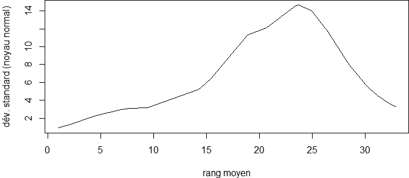
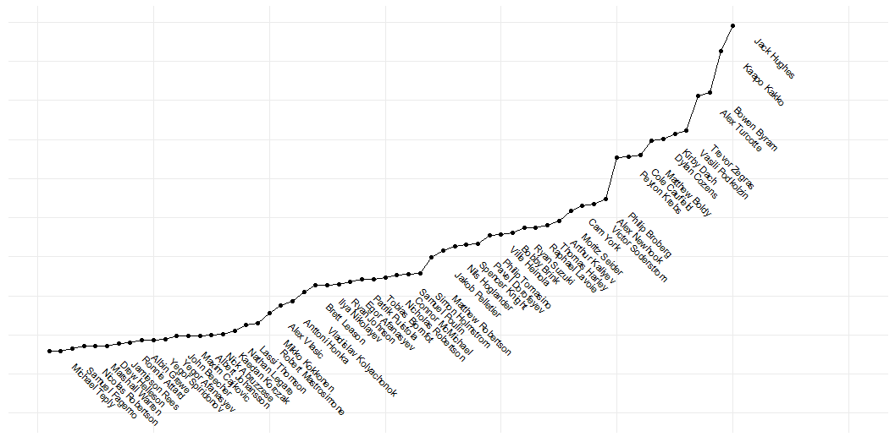

Dans le cadre de la fin de semaine d'analytique de sports récemment
organisée par des .Layeuriens, nous (L. Caron, L.-A. Vallière-Lavoie et
moi-même) avons construit une petite routine qui aggrège différents
*draft rankings* pour en former un unique. Pardonnez le manque
d'explications lolk. En passant, allez voir le
[ShinyApp](https://stecaron.shinyapps.io/shiny-app/) créé par d'autres
participants de la fin de semaine (un truc de tennis).

rvest
-----

En gros, nous avons *rvest* des listes
[mynhldraft.com](http://www.mynhldraft.com/2019-nhl-draft/2019-nhl-draft-rankings/)
:

    library(rvest)
    library(data.table)

    html <- read_html("http://www.mynhldraft.com/2019-nhl-draft/2019-nhl-draft-rankings/")

    tables <- html %>%
      html_nodes("table")

    tables <- lapply(tables, html_table, fill=T)
    tables <- tables[-1]

    temp <- as.data.table(do.call(cbind, tables))[-1,]

    names(temp) <- unlist(temp[1,])
    names(temp) <- gsub("\n", "", names(temp))
    temp <- temp[-1,]

    head(temp)[,1:3]

    ##    V1 Future Considerations    June 7th
    ## 1:  1                       Jack Hughes
    ## 2:  2                       Kakko Kaapo
    ## 3:  3                       Bowen Byram
    ## 4:  4                  Vasili Podkolzin
    ## 5:  5                     Alex Turcotte
    ## 6:  6                      Peyton Krebs
    ##    Russ Cohen    Sportsology    June 7th
    ## 1:                           Jack Hughes
    ## 2:                           Kaapo Kakko
    ## 3:                         Alex Turcotte
    ## 4:                      Vasily Podkolzin
    ## 5:                           Bowen Byram
    ## 6:                         Cole Caufield

Les 14 listes (nous en avons retiré 2 parce qu'elles concernaient
seulement les Européens et les Nord-Américains respectivement)
contiennent un classement des 32 meilleurs espoirs (choix de première
ronde) pour le repêchage de la LNH selon différents experts.

Métriques
---------

Après un peu plus de nettoyage (on vous épargne les détails), nous avons
créé un data.table `main`. Avec un passage de *data.table* à *dplyr*,
nous avons comparer quelques métriques. En particulier, nous avons
effectué une correction (très *de base*) pour palier au fait que
certains joueurs ne se retrouvaient pas dans toutes les listes : 60
joueurs au total aparaissaient dans au moins une liste, mais seulement
32 joueurs sont sélectionnés en première ronde. Voici notre top 10 du
repêchage selon cette métrique.

    library(tibble)
    library(purrr)
    library(magrittr)
    library(dplyr)

    main <- fread("data/main.R", encoding = "UTF-8")

    by_player <- data.table(player = player <- unique(unlist(main[, player])),
                             ID = as.numeric(as.factor(player)))

    main %<>%
      left_join(by_player, by = "player")

    by_player <-
      by_player %>%
      left_join(main %>%
                  group_by(ID) %>%
                  summarise(straight_average = mean(rank),
                            min_ranking = min(rank),
                            max_ranking = max(rank),
                            variance = var(rank),
                            count = n(),
                            median = median(rank),
                            corrected_average = (sum(rank) + (14 - count) * 33) / 14) %>%
                  mutate(final_selection = rank(corrected_average)),
                by = "ID")

    by_player[order(by_player$final_selection),]$player[1:10]

    ##  [1] "Jack Hughes"      "Kaapo Kakko"      "Bowen Byram"     
    ##  [4] "Alex Turcotte"    "Trevor Zegras"    "Kirby Dach"      
    ##  [7] "Dylan Cozens"     "Vasili Podkolzin" "Matthew Boldy"   
    ## [10] "Peyton Krebs"

Multi-dimensional scaling
-------------------------

Avec le temps qu'il nous restait, nous avons ensuite décidé de
construire une matrice de distance (entre les joueurs) calculée en
considérant le vecteurs des rangs :

    ##      Albert Johansson Albin Grewe Alex Newhook Alex Turcotte Alex Vlasic
    ## [1,]               33          28           15             3          33
    ## [2,]               33          33           14             4          25
    ## [3,]               33          33           11             3          24
    ## [4,]               33          33           18            10          33
    ## [5,]               33          33           13             5          33

Chaque rangée correspond aux prédictions d'un expert. Nous avons
remplacé les NA (ceux qui ne sont pas parmi les 32 premiers choix) par
des 33. Clairement, ce n'est pas la meilleure chose à faire, les étapes
suivantes auraient pu nous aider à faire une imputation plus sensée,
mais nous n'avons pas pris le temps...

Nous avons calculé une sorte de variation locale des rangs :

Naturellement, plus on considère des rangs élevés, plus il y a
d'incertitude quant à ceux-ci (du moins cette année). Ce qui se passe
après 25 ne fait plus de sens puisque nos données sont censurées à
droite. Nous avons utilisé ceci (en gardant la valeur maximum après le
*peak*), pour calculer des distances *somewhat* normalisées (entre les
joueurs). Finalement, la matrice de distance obtenue nous a permis de
projeté nos données sur une droite (une seule dimension) : ce qu'on
appelle du positionnement multidimensionnel. En fait, nous avons
*pluggé* la matrice de distance dans la fonction `cmdscale`. Les valeurs
obtenues forment l'axe vertical dans la figure suivante.

En gardant un espacement constant sur l'axe horizontal, on peut
apprécier à quel point Jack Hughes et Kaapo Kakko se démarque du reste
(ils étaient toujours premier et deuxième...).

À+
